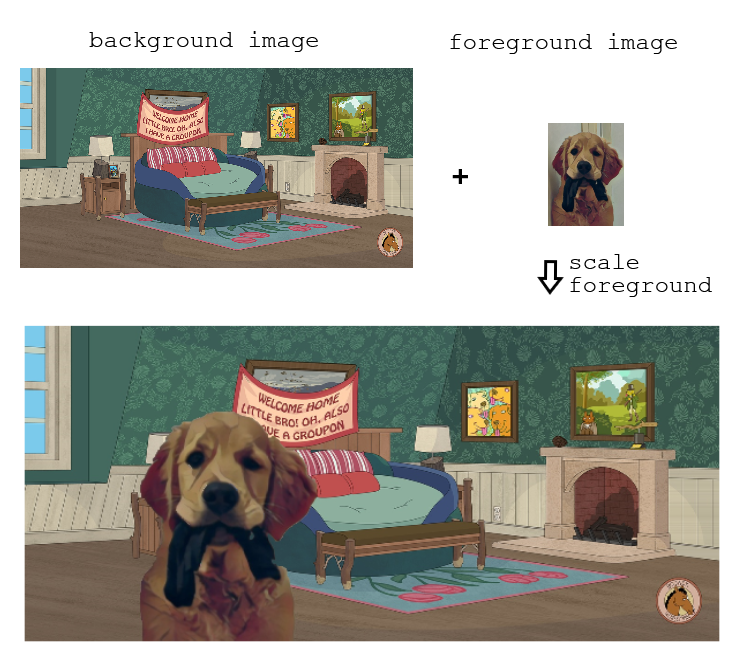

# CppND Capstone Project
## PicturePatch using OpenCV

## Project Overview
This project is a part of the [Udacity C++ Nanodegree Program](https://www.udacity.com/course/c-plus-plus-nanodegree--nd213), 
and it aims to generate an image by combining an object from one image with a 
background image. The user has the ability to choose the desired position of the 
object within the background and adjust its size as desired.

## Key Features
* Generates a combined image by blending an object from one image with a background image.
* User-friendly interface that allows selecting the desired position of the object in the background image.
* Allows the user to scale the size of both the object and the background images to their desired dimensions.

## Dependencies

* cmake >= 3.11
    * All OSes: [click here for installation instructions](https://cmake.org/install/)
* make >= 4.1 (Linux, Mac), 3.81 (Windows)
    * Linux: make is installed by default on most Linux distros
* gcc/g++ >= 5.4
    * Linux: gcc / g++ is installed by default on most Linux distros
* OpenCV >= 4.1
    * Linux: [click here for installation instructions](https://docs.opencv.org/4.x/d7/d9f/tutorial_linux_install.html)
* yaml-cpp >= 0.5
    * For more information [click here](https://github.com/jbeder/yaml-cpp)

## Build

1. Clone this repo.
2. Make a build directory in the top level directory: `mkdir build && cd build`.
3. Compile: `cmake .. && make`.

## Run

From `build` directory run the executable `./PicturePatch`.

## Configuration File

In the `config` folder, you will find a file containing example parameters that 
generate the image shown above. You can modify the values of these parameters to 
match other images, or you can make the program interactive by marking the contents
of the file as a comment.

`Note`: The parameters in the configuration file can be adjusted to fit your specific needs and requirements.

## File Structure

* `config`: Contains `exp.yaml` file containing example parameters that generate the image shown above.
* `data`: Contains few `background/foreground` images that may be used for the program. The output image is also saved in this folder.
* `include` : Contains the header files:
  * `app.h` - This class is responsible for the flow of the program.
  * `image.h` - This class is responsible for creating the image.
  * `parser.h` - This class is responsible for receiving input from the `terminal/config file`.
* `src` : Contains the source files `app.cpp`, `image.cpp` and  `parser.cpp`.
* `test` : Contains the file `utest_images.cpp`, which is used for testing the program. 
   The testing is done using the `gtest` library. To avoid creating a dependency on the library, the compile line in the `CMakeLists.txt` file is commented out.
* `CMakeLists.txt` : Cmake configuration file.
* `README.md` : This file.

## Rubric

### README (All Rubric Points REQUIRED)

DONE | CRITERIA | MEETS SPECIFICATIONS                                                                                                                                                                                                                                                                 | WHERE IN THE CODE 
--- |----------|--------------------------------------------------------------------------------------------------------------------------------------------------------------------------------------------------------------------------------------------------------------------------------------|-----------------------------------
&check;| A README with instructions is included with the project | The README is included with the project and has instructions for building/running the project. If any additional libraries are needed to run the project, these are indicated with cross-platform installation instructions.  You can submit your writeup as markdown or pdf. | Here                               
&check;| The README indicates which project is chosen. | The README describes the project you have built. The README also indicates the file and class structure, along with the expected behavior or output of the program.                                                                                                     | Here                               
&check;| The README includes information about each rubric point addressed. | The README indicates which rubric points are addressed. The README also indicates where in the code (i.e. files and line numbers) that the rubric points are addressed. | Here                               

### Compiling and Testing (All Rubric Points REQUIRED)

DONE | CRITERIA                             | MEETS SPECIFICATIONS                                                                                                                                                                                                        | WHERE IN THE CODE 
--- |--------------------------------------|-----------------------------------------------------------------------------------------------------------------------------------------------------------------------------------------------------------------------------|-----------------------------------
&check;| The submission must compile and run. | The project code must compile and run without errors. We strongly recommend using `cmake` and `make`, as provided in the starter repos. If you choose another build system, the code must compile on any reviewer platform. | compiled and run on the course server.                            

### Loops, Functions, I/O

DONE | CRITERIA | MEETS SPECIFICATIONS | WHERE IN THE CODE 
--- |---------|-------------------|-----------------------------------
&check;| The project demonstrates an understanding of C++ functions and control structures. | A variety of control structures are used in the project. The project code is clearly organized into functions. | *.cpp
&check;| The project reads data from a file and process the data, or the program writes data to a file.  | The project reads data from an external file or writes data to a file as part of the necessary operation of the program. | read/write image. read from config file. 
&check;| The project accepts user input and processes the input. | The project accepts input from a user as part of the necessary operation of the program. | parser.cpp   

### Object Oriented Programming

DONE | CRITERIA                                                       | MEETS SPECIFICATIONS                                                                                                                                                                         | WHERE IN THE CODE 
--- |----------------------------------------------------------------|----------------------------------------------------------------------------------------------------------------------------------------------------------------------------------------------|-----------------------------------
&check;| The project uses Object Oriented Programming techniques.       | The project code is organized into classes with class attributes to hold the data, and class methods to perform tasks.                                                                       | \*.cpp *.h
&check;| Classes use appropriate access specifiers for class members.   | All class data members are explicitly specified as public, protected, or private.                                                                                                            | *.h
&nbsp;| Class constructors utilize member initialization lists.        | All class members that are set to argument values are initialized through member initialization lists.                                                                                       | 
&check;| Classes abstract implementation details from their interfaces. | All class member functions document their effects, either through function names, comments, or formal documentation. Member functions do not change program state in undocumented ways.      | \*.cpp *.h
&check;| Classes encapsulate behavior.                                  | Appropriate data and functions are grouped into classes. Member data that is subject to an invariant is hidden from the user. State is accessed via member functions.                        | \*.cpp *.h
&nbsp;| Classes follow an appropriate inheritance hierarchy. | Inheritance hierarchies are logical. Composition is used instead of inheritance when appropriate. Abstract classes are composed of pure virtual functions. Override functions are specified. |
&check;| Overloaded functions allow the same function to operate on different parameters. | One function is overloaded with different signatures for the same function name.                                                                                                             | image.cpp resizeImg 
&nbsp;| Derived class functions override virtual base class functions. | One member function in an inherited class overrides a virtual base class member function.                                                                                                    |
&nbsp;| Templates generalize functions in the project. | One function is declared with a template that allows it to accept a generic parameter.                                                                                                       |  

### Memory Management

DONE | CRITERIA                                                                                  | MEETS SPECIFICATIONS                                                                                                                                                                 | WHERE IN THE CODE 
--- |-------------------------------------------------------------------------------------------|--------------------------------------------------------------------------------------------------------------------------------------------------------------------------------------|-----------------------------------
&nbsp;| The project makes use of references in function declarations.                             | At least two variables are defined as references, or two functions use pass-by-reference in the project code.                                                                        |
&nbsp;| The project uses destructors appropriately.                                               | At least one class that uses unmanaged dynamically allocated memory, along with any class that otherwise needs to modify state upon the termination of an object, uses a destructor. |
&nbsp;| The project uses scope / Resource Acquisition Is Initialization (RAII) where appropriate. | The project follows the Resource Acquisition Is Initialization pattern where appropriate, by allocating objects at compile-time, initializing objects when they are declared, and utilizing scope to ensure their automatic destruction. |
&nbsp;| The project follows the Rule of 5.                                                        | For all classes, if any one of the copy constructor, copy assignment operator, move constructor, move assignment operator, and destructor are defined, then all of these functions are defined. |
&nbsp;| The project uses move semantics to move data, instead of copying it, where possible.      | For classes with move constructors, the project returns objects of that class by value, and relies on the move constructor, instead of copying the object. |
&nbsp;| The project uses smart pointers instead of raw pointers.                                  | The project uses at least one smart pointer: `unique_ptr`, `shared_ptr`, or `weak_ptr`. The project does not use raw pointers. | 

### Concurrency

DONE | CRITERIA                          | MEETS SPECIFICATIONS                                                                                                                            | WHERE IN THE CODE 
--- |-----------------------------------|-------------------------------------------------------------------------------------------------------------------------------------------------|-----------------------------------
&nbsp;| The project uses multithreading.  | The project uses multiple threads in the execution.                                                                                             |
&nbsp;| A promise and future is used in the project. | A promise and future is used to pass data from a worker thread to a parent thread in the project code.                                          |
&nbsp;| A mutex or lock is used in the project. | A mutex or lock (e.g. `std::lock_guard` or `std::unique_lock`) is used to protect data that is shared across multiple threads in the project code. |
&nbsp;| A condition variable is used in the project. | A `std::condition_variable` is used in the project code to synchronize thread execution.                                                          | 